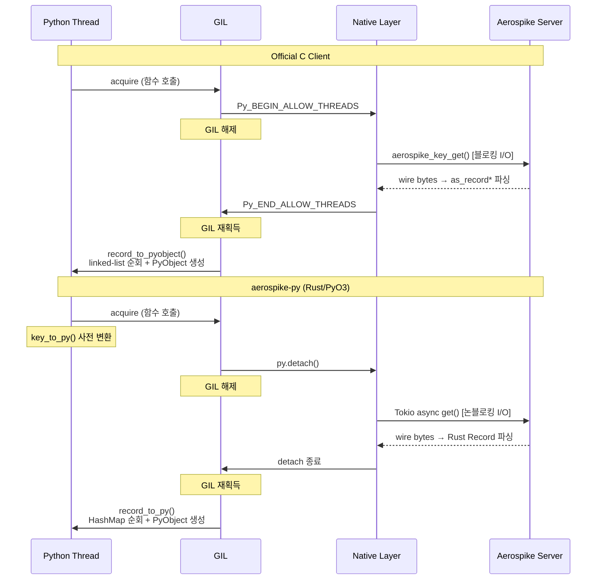
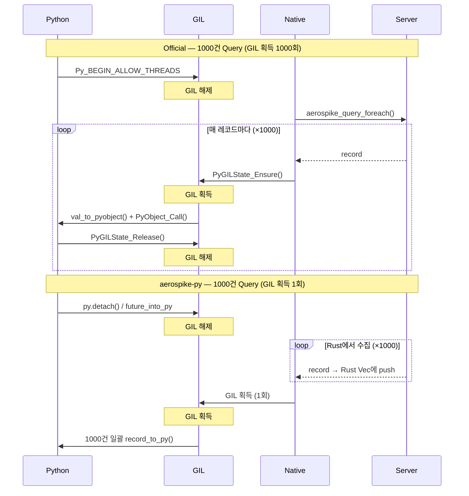
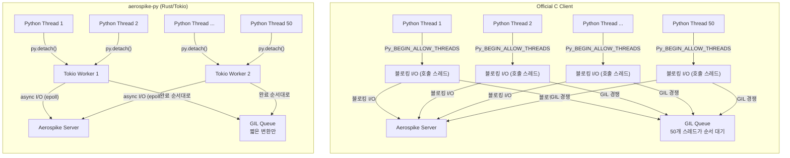

# aerospike-py vs Official C Client 성능 비교 분석

aerospike-py와 Official Aerospike Python Client(C 바인딩)의 성능 차이가 발생하는 구조적 원인을 분석한 문서입니다.

---


## 1. I/O 모델 차이 (가장 큰 차이)

| | Official C Client | aerospike-py |
|---|---|---|
| I/O 모델 | 호출 스레드에서 블로킹 I/O (scan/query는 내부 스레드풀로 노드별 병렬화) | Tokio async/epoll 기반 논블로킹 |
| 커넥션 관리 | 스레드당 커넥션 or 커넥션풀 | 소수 Tokio 워커가 다수 커넥션 멀티플렉싱 |
| Python 스레드 50개 동시 요청 | 50개가 각각 `Py_BEGIN_ALLOW_THREADS` → 호출 스레드에서 직접 블로킹 I/O | 50개가 `py.detach()` → 2개 Tokio 워커가 비동기 처리 |

Official은 Python 스레드 수만큼 OS 레벨 블로킹 I/O가 발생하고, aerospike-py는 2개 Tokio 워커가 epoll로 수백 개 요청을 동시 처리합니다. 단건에서는 차이 없지만, **동시성이 올라갈수록** 차이가 벌어집니다.

---

## 2. GIL 보유 시간 차이

둘 다 GIL 안에서는 "C/Rust 구조체 → Python dict 변환"만 수행하지만, 변환 효율이 다릅니다.

### Official Client (conversions.c)

```
GIL 획득 후:
  as_record_foreach(rec, callback, ...)   ← as_bins 동적 배열 순회
    → as_val_type() switch                ← 매 bin마다 타입 체크 (union 분기)
    → PyDict_SetItemString()              ← 문자열 해싱
    → val_to_pyobject() 재귀              ← 중첩 map/list면 깊어짐
```

### aerospike-py (types/record.rs + value.rs)

```
GIL 획득 후:
  for (name, value) in &record.bins       ← HashMap iterator (연속 메모리)
    → match val { Value::Int(i) => ... }  ← Rust enum 패턴매칭 (분기 예측 유리)
    → dict.set_item(name, converted)?     ← PyO3 래핑
```

### 차이 요인

- C `as_record`는 `as_bins` 동적 배열 + `as_val` union 타입 → 타입별 switch 분기 필요
- Rust `HashMap<String, Value>`는 enum discriminant로 직접 패턴매칭 → 분기 예측 유리
- 단건 get에서 ~수 μs 차이지만, **50개 스레드가 GIL 경쟁**하면 큐잉 지연으로 증폭

---

## 3. GIL 관리 패턴 비교

### Official Client — get 연산

```c
// get.c:93-95
Py_BEGIN_ALLOW_THREADS                              // GIL 해제
aerospike_key_get(self->as, &err, policy, &key, &rec);  // 네트워크 I/O + 파싱
Py_END_ALLOW_THREADS                                // GIL 재획득

// GIL 보유 상태에서 변환
record_to_pyobject(self, &err, rec, &key, &py_rec);
```

### aerospike-py — get 연산

```rust
// client.rs
let key_py = key_to_py(py, &args.key)?;    // GIL 보유: 키 사전 변환

let record = py.detach(|| {                 // GIL 해제
    RUNTIME.block_on(async {
        client.get(&rp, &args.key, Bins::All).await  // 네트워크 I/O + Rust 파싱
    })
})?;                                        // GIL 재획득

record_to_py_with_key(py, &record, key_py)  // GIL 보유: Python dict 변환만
```

단건 get에서는 두 클라이언트 모두 "GIL 해제 → I/O → GIL 재획득 → 변환" 패턴으로 유사합니다.

---

## 4. Query/Scan 콜백 패턴 (가장 극적인 차이)

### Official Client — 매 레코드마다 GIL 경쟁

```c
// query/foreach.c
// 메인: GIL 해제 후 query 실행
Py_BEGIN_ALLOW_THREADS
aerospike_query_foreach(self->client->as, &err, policy, &query, each_result, &data);
Py_END_ALLOW_THREADS

// 콜백: 매 레코드마다 GIL 잡았다 놓았다
static bool each_result(const as_val *val, void *udata) {
    PyGILState_STATE gstate = PyGILState_Ensure();   // GIL 획득
    val_to_pyobject(...);                             // 변환
    PyObject_Call(py_callback, py_arglist, NULL);      // Python 콜백 호출
    PyGILState_Release(gstate);                       // GIL 해제
    return true;
}
```

### aerospike-py — 일괄 처리

```rust
// query.rs — GIL 없이 전체 결과를 Rust Vec에 수집
let results: Vec<Record> = py.detach(|| {
    RUNTIME.block_on(async {
        let rs = client.query(&policy, PartitionFilter::all(), statement).await?;
        let mut stream = rs.into_stream();
        let mut results = Vec::new();
        while let Some(rec) = stream.next().await {
            results.push(rec?);
        }
        Ok(results)
    })
})?;

// GIL 획득 1회로 일괄 변환
results.iter().map(|r| record_to_py(py, r, None)).collect()
```

1000건 query 결과 기준:
- **Official**: GIL 획득/해제 **1000회** + 매번 `PyGILState_Ensure` 오버헤드
- **aerospike-py**: GIL 획득 **1회**로 1000건 일괄 변환

---

## 5. Async Client 구조 차이

### Official Client

- **async 미지원**. `Py_BEGIN_ALLOW_THREADS`로 GIL만 해제할 뿐, Python asyncio 통합 없음
- asyncio 사용 시 `loop.run_in_executor()`로 스레드풀 우회 필요

### aerospike-py — 네이티브 async

```rust
// async_client.rs
fn get<'py>(&self, py: Python<'py>, ...) -> PyResult<Bound<'py, PyAny>> {
    let key_py = key_to_py(py, &args.key)?;

    future_into_py(py, async move {
        let record = client.get(&rp, &args.key, Bins::All).await?;
        Ok(PendingRecord { record, key_py })  // Deferred conversion
    })
}

// PendingRecord: GIL 없이 Rust 데이터만 보유
// future_into_py가 내부적으로 GIL 1회 획득하여 IntoPyObject 호출
impl<'py> IntoPyObject<'py> for PendingRecord {
    fn into_pyobject(self, py: Python<'py>) -> Result<...> {
        record_to_py_with_key(py, &self.record, self.key_py)
    }
}
```

- `future_into_py`가 Python awaitable 반환 → asyncio event loop와 직접 통합
- Deferred conversion 패턴으로 **double-GIL-acquire 방지**
- Tokio 워커가 I/O 담당, GIL 획득은 결과 변환 시 1회만

---

## 6. Python ↔ Native 경계 오버헤드

| | Official | aerospike-py |
|---|---|---|
| 인자 변환 | Python dict → C 구조체 (수동 파싱) | Python dict → Rust 구조체 (PyO3 자동 추출) |
| 에러 처리 | `as_error` → Python exception (수동) | `Result<T, E>` → PyErr (자동 매핑) |
| 메모리 관리 | 수동 `Py_INCREF/DECREF` | PyO3 소유권 기반 자동 관리 |

Official의 `conversions.c`는 ~2500줄의 수동 변환 코드입니다.

---

## 7. 메모리 할당 패턴

```
Official:
  C client가 malloc → as_record* 생성
  Python이 PyObject 생성 (별도 힙)
  as_record_destroy()로 C 메모리 해제
  → 두 벌의 메모리 할당/해제

aerospike-py:
  Rust가 스택/힙에 Record 생성
  Python이 PyObject 생성
  Rust Record는 스코프 종료 시 drop (deterministic)
  → Rust allocator가 효율적이고, drop이 예측 가능
```

---

## 시나리오별 성능 차이 요약

| 시나리오 | 주요 차이 원인 | 예상 차이 |
|---|---|---|
| **단건 get (1 스레드)** | 거의 없음. I/O latency가 지배적 | ~동등 |
| **단건 get (50 스레드)** | GIL 보유 시간 × 경쟁 횟수 | aerospike-py 유리 |
| **batch get (1000건)** | I/O 모델 + 변환 효율 | aerospike-py 유리 |
| **query/scan (대량)** | 콜백 패턴 (매건 GIL vs 일괄) | **aerospike-py 크게 유리** |
| **async (asyncio)** | Official 미지원 vs 네이티브 async | **aerospike-py 압도적** |

---

## 결론

단건 요청에서는 두 클라이언트의 성능이 비슷합니다. 핵심 차이는 **동시성과 대량 처리**에서 나타납니다:

1. **I/O 모델**: 블로킹 스레드풀 vs Tokio async — 동시 요청 처리 효율
2. **GIL 경쟁 빈도**: query/scan에서 매 레코드마다 GIL vs 일괄 처리
3. **네이티브 async 지원**: asyncio 직접 통합으로 스레드 오버헤드 제거
4. **데이터 구조 효율**: linked-list 순회 vs HashMap iterator의 캐시 친화성

GIL 보유 시간 자체보다 **GIL 경쟁 빈도와 I/O 모델**이 실질적 병목입니다.

---

## 아키텍처 다이어그램

### 단건 Get 연산 흐름 비교



### Query/Scan GIL 경쟁 패턴 비교



### 동시성 모델 비교 (50 스레드)



### ASCII 다이어그램

#### 단건 Get — GIL 타임라인

```
시간 →

Official C Client:
  Python Thread:  ──[GIL]──┐                              ┌──[GIL: record_to_pyobject]──
  GIL 상태:       ████████░░░░░░░░░░░░░░░░░░░░░░░░░░░░░░░░████████████████████████████░░
  C Client:                └──[네트워크 I/O + C 파싱]──────┘
                                (GIL 해제)                    (GIL 보유: linked-list 순회
                                                               + PyObject 생성)

aerospike-py:
  Python Thread:  ──[GIL]──┐                              ┌──[GIL: record_to_py]──
  GIL 상태:       ████████░░░░░░░░░░░░░░░░░░░░░░░░░░░░░░░░██████████████████░░░░░░░░░░░
  Tokio Worker:            └──[async I/O + Rust 파싱]──────┘
                                (GIL 해제)                    (GIL 보유: HashMap 순회
                                                               + PyObject 생성)
                                                              ↑ 더 짧음 (캐시 친화적)

범례: ████ = GIL 보유,  ░░░░ = GIL 해제
```

#### Query 1000건 — GIL 경쟁 패턴

```
시간 →

Official C Client (GIL 획득/해제 1000회):
  GIL:  ░░░░██░██░██░██░██░██░██░██░██░██░██░██░██░ ... (×1000) ... ██░░░
              ↑  ↑  ↑  ↑
              각 레코드마다 PyGILState_Ensure/Release
              다른 스레드는 이 틈에 GIL 경쟁

aerospike-py (GIL 획득 1회):
  GIL:  ░░░░░░░░░░░░░░░░░░░░░░░░░░░░░░░░░░░░░░░░████████████████████░░░
        ←── Rust에서 1000건 수집 (GIL 없음) ──→  ←── 일괄 변환 ──→
                                                   다른 스레드 블로킹 없음

범례: ████ = GIL 보유,  ░░░░ = GIL 해제
```

#### 50 스레드 동시성 모델

```
Official C Client:
  ┌─────────────────────────────────────────────────────────┐
  │  Python Threads (50개)                                   │
  │  [T1] [T2] [T3] [T4] ... [T50]                          │
  │    │    │    │    │         │                             │
  │    ▼    ▼    ▼    ▼         ▼                             │
  │  Py_BEGIN_ALLOW_THREADS (각각 GIL 해제)                   │
  │    │    │    │    │         │                             │
  │    ▼    ▼    ▼    ▼         ▼                             │
  │  ┌──────────────────────────────┐                        │
  │  │  각 스레드가 직접 블로킹 I/O  │                        │
  │  │  소켓 호출 × 50              │──→ Aerospike Server   │
  │  └──────────────────────────────┘                        │
  │    │    │    │    │         │                             │
  │    ▼    ▼    ▼    ▼         ▼                             │
  │  ┌──────────────────────────────┐                        │
  │  │  GIL 경쟁 Queue              │                        │
  │  │  50개 스레드가 동시에 GIL 요청 │                        │
  │  │  → 순차 대기 → 지연 증가      │                        │
  │  └──────────────────────────────┘                        │
  └─────────────────────────────────────────────────────────┘

aerospike-py:
  ┌─────────────────────────────────────────────────────────┐
  │  Python Threads (50개)                                   │
  │  [T1] [T2] [T3] [T4] ... [T50]                          │
  │    │    │    │    │         │                             │
  │    ▼    ▼    ▼    ▼         ▼                             │
  │  py.detach() (각각 GIL 해제)                              │
  │    │    │    │    │         │                             │
  │    ▼    ▼    ▼    ▼         ▼                             │
  │  ┌────────────┐ ┌────────────┐                           │
  │  │ Tokio W1   │ │ Tokio W2   │                           │
  │  │ epoll 기반  │ │ epoll 기반  │──→ Aerospike Server      │
  │  │ 25개 요청   │ │ 25개 요청   │                           │
  │  │ 멀티플렉싱  │ │ 멀티플렉싱  │                           │
  │  └────────────┘ └────────────┘                           │
  │    │ (완료 순서대로)  │                                    │
  │    ▼                 ▼                                    │
  │  ┌──────────────────────────────┐                        │
  │  │  GIL 획득 (짧은 변환만)       │                        │
  │  │  완료된 것부터 순차 변환       │                        │
  │  │  → 경쟁 최소화               │                        │
  │  └──────────────────────────────┘                        │
  └─────────────────────────────────────────────────────────┘
```
